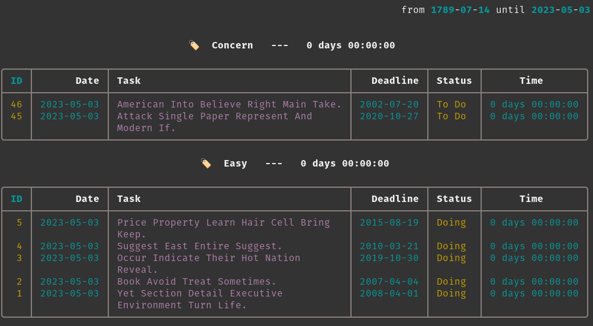

  

 
    

A minimalist to-do list with built-in timer to keep your tasks on track. 

Timerdo is an intuitive CLI application that will help you focus on what really matters.

---
## Requirements

Python 3.11+

No fear of the command-line interface :laughing:.

---

**Source Code:** https://github.com/caiomts/timerdo  

**Documentation:** http://caiomts.github.io/timerdo

:warning: Early stage project[^2]

---

## Getting started

http://caiomts.github.io/timerdo/#getting-started

## CLI Reference

http://caiomts.github.io/timerdo/#CLI-Reference

## API Reference

http://caiomts.github.io/timerdo/#API-Reference

## Releases

http://caiomts.github.io/timerdo/#Releases

[^2]: Data models are mostly stable, but visualization and queries are in full development and the API can change quickly.