Timerdo is a CLI app that manages a minimalist to-do list with built-in timer 
to track your work and keep you productive.

If you are interested about how Timerdo is built you can go  directly [here](https://github.com/caiomts/timerdo#about)

# Installation

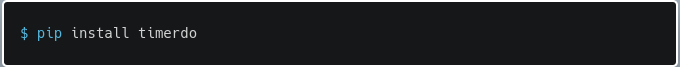

Timerdo is 100% python, so pip installation should work regardless of your OS. 

*You may have to put it in the PATH to call it directly with the `timerdo` command.* 

# Quick Start

**Timerdo was thought to track tasks, so tasks are its building blocks. 
Keep that in mind.** 

**Done is Done. You can't do anything else with a task once it's done.**

## Add task
So, let's add your first:

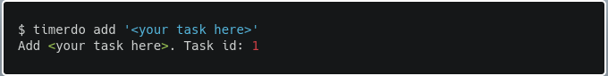

Task is a required argument, but you have some options. Let's take a look on it:

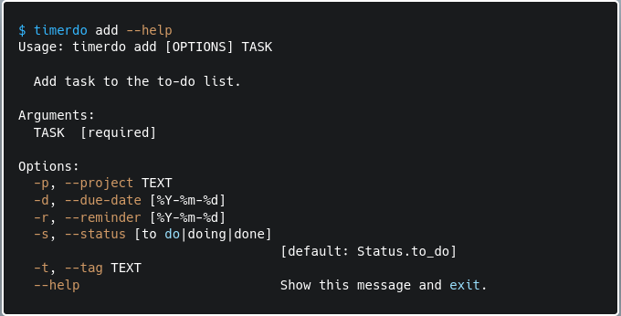

So, you can also define a project to the task, but remember, 
tasks are the building blocks, so there is no project without a task!

In addition, you can set a due date for your task and a tag.

The reminder has a special feature. 
It will appear in your to-do list only after the defined day. 
This is for the type of task that you have to do at a specific time or can just remember later.  

Finally, you can change the default status, but keep in mind. Done is Done.
You can visualize what was done, but that's it.

## Start the timer

Now that you already have a task, let's keep track of the time you spend on it.

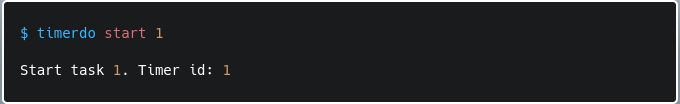

To start tracking the task ID is a required argument, 
I'll show you in a bit how to get to know the task IDs, but first let's take a look at the help.

Nice, you can also set a *timebox* with the `--duration` flag! If you do so,
Timerdo keeps running and a message will pop up when you are done.

But How do I know my task IDs?!

## View

The Timerdo workflow was thought to keep things simple, so you add your tasks and
whenever you need to see your to-do list at the end of a task or at the start of your day
you simply call the view.

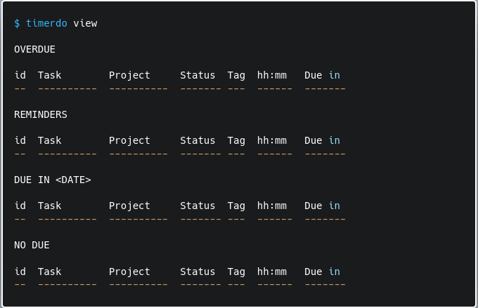

This is the structure of the view, but Timerdo will only show you heads that
you have at least one task.

Let's see the help.

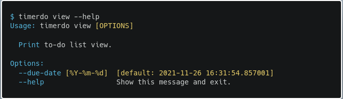

You can set the date until when it shows the tasks with due dates. The default is
one week ahead.

## Stop

Now, how do we stop the timer?

Timerdo keeps track of task status! So, whenever you start a task, if the status
is `to do`, Timerdo automatically changes it to `doing` and whenever you stop the timer
it asks you if you have finished the task. Cool, right?

*Timerdo don't let you work on a done task as well ;)*

As always, let's look at the help:

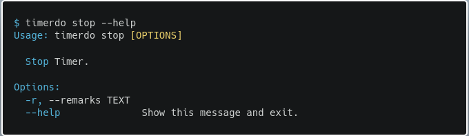

You can also add a note to keep track of something important.
If you start a timer as a *timebox* this option will also be asked by the prompt.

Now you know how to use the main features, and this is almost everything
you need to use Timerdo. 

But let's say you are interested in seeing all tasks you
have on your to-do list, regardless of context. Or you are interested in seeing
all tasks in the same project... 

# More features

First let's take a look at the general help. First things first, you can install
completion ;).

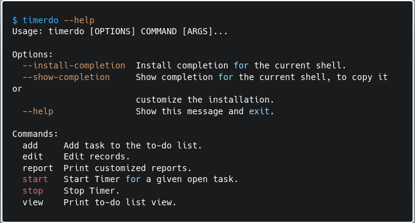

We've already covered the following commands: `add`, `start`, `view` and `stop`.
But Timerdo also has `edit` and `report`. Actually, both are separate modules with
another set of commands.

## Report

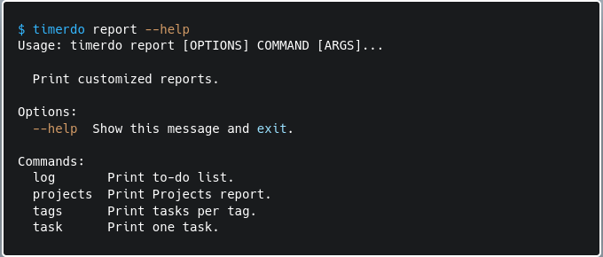

The report module has four commands.

### Log

The `log` command will just print your to-do list with all your tasks regardless of the state. This command has only one
option `--init` that restricts printed tasks by the day they entered the list. The default is four weeks before the call.

### Projects

`Projects` has more functionalities, and we can refresh some conceptual points.

We already know tasks are Timerdo building blocks, so the concept of project is an abstraction
whereby, we can bunch a lot of tasks simply giving them the same project name.

This design has some important implications. One of the most important is: You can't
add new tasks with the same project name if all old tasks with this same name were done.
As there is nothing to be done with a done task, there is no ongoing project with no tasks to be done.

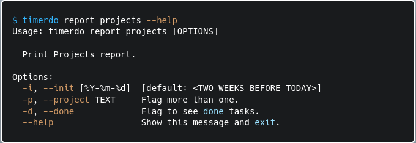

Calling `project` command with no flag, brings up a list of all tasks sorted by 
project name, and you will have the information of how much time you've spent in each
project (or in a group of tasks you bunched together).

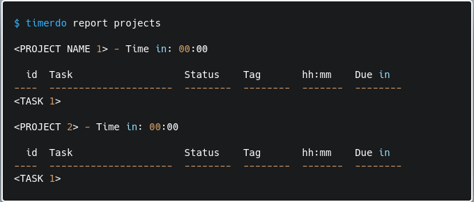

This command has also three options, the first one (`--init`) has a default that 
restricts the projects to show up if at least one of the task in the project was not initiated after the given date.

The second option (`--project`) allows you to define which projects should be displayed. 
Timerdo also allows you to define more than one project (see below).

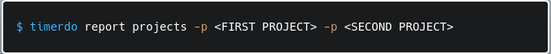

Finally, the final option (`--done`) is a flag to also see done tasks in projects.

### Tags

`tags` command has almost the same structure as `projects`, with the same options.
The only difference is that it does not display how much time was spent per tag. 
Tag has no special feature, so you can use it as you want.

### Task
The prom queen! `Task` command has only one required argument with no options.

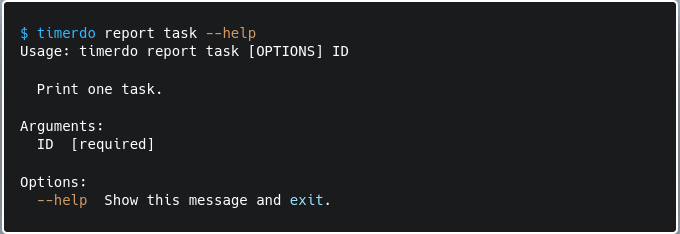

Here is the only place where you can see all information about a given task.
Timerdo will also display another table with all the timers you have for that given
task. Cool right?

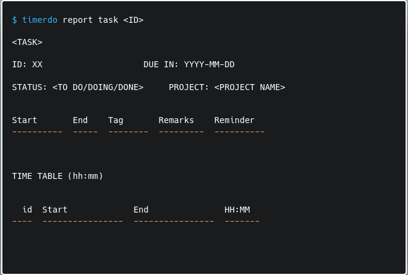

But what if I do something wrong?! This is where the last module comes in.

## Edit

`Edit` is where you can - you probably already guessed - edit your records.

It's not a good place to be, so Timerdo will display raw records and ask for confirmations every time
you call a command. 

**If you delete our modify something, everything related to it will be lost. Be aware.**

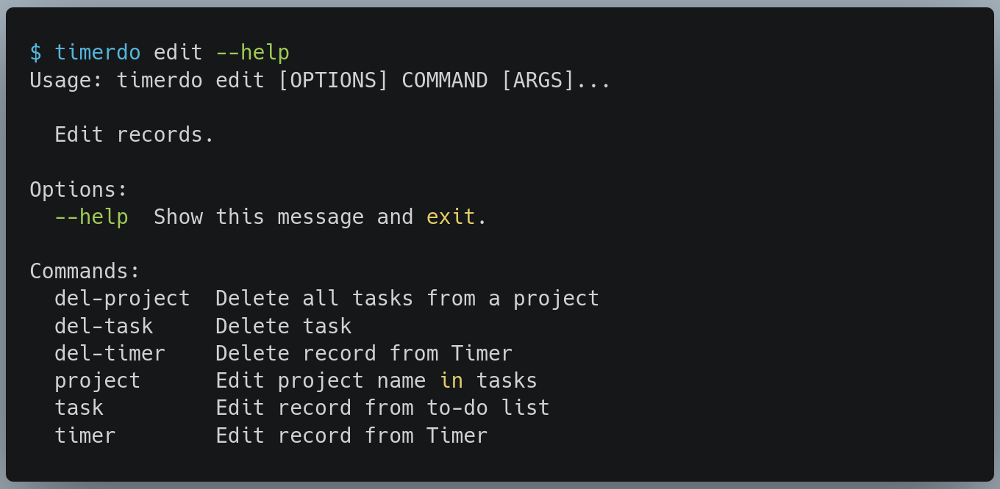

The module has four commands, where you can delete or edit tasks and where you can
rely on the project name as a glue to delete all tasks with the same project name at once.

Both `del-task` and `del-project` have only one required argument - `id` or `project`. 

`project` command has two required arguments: the name of the project and the new name.
It will just change the project name in all tasks with the same project name.

`task` command works like `add` command but the first argument is the id of the task
you are trying to modify.

# About

Timerdo is a side project and was born out of my personal necessity. I'd been using [Watson](https://github.com/TailorDev/Watson) 
for a while and it's very handy, but I had to keep a to-do list apart. Currently, Timerdo is
an app I use daily to maintain my to-do list while I keep track my time.

Timerdo is build in python but strongly rely on [SQLModel](https://github.com/tiangolo/sqlmodel) and [Typer](https://github.com/tiangolo/typer). 
[@tiangolo](https://github.com/tiangolo) has the best documentations ever, and I'm so grateful!

Timerdo work with a SQLite database and uses [tabulate](https://github.com/astanin/python-tabulate) for all prints.

All images in this README were created with [carbon](https://carbon.now.sh/). 

# Release

0.0.1

# License
Timerdo is released under MIT License.

